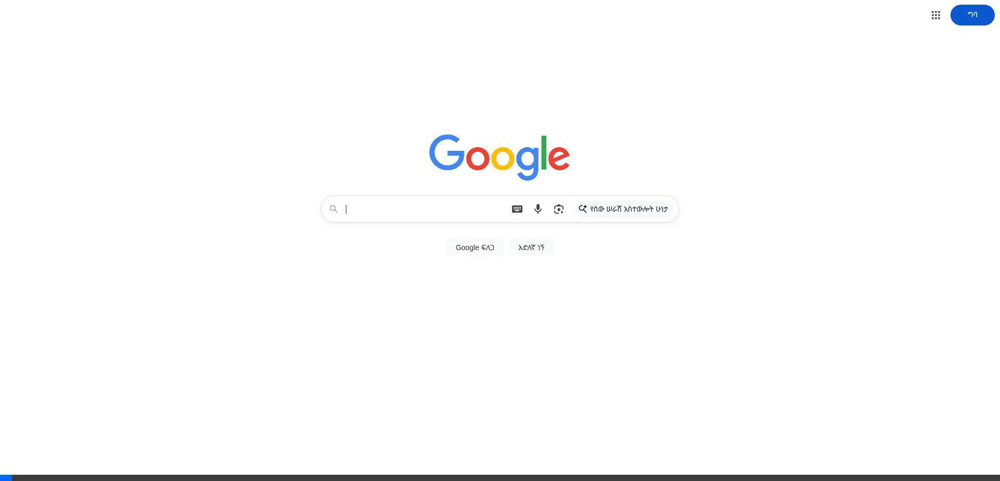
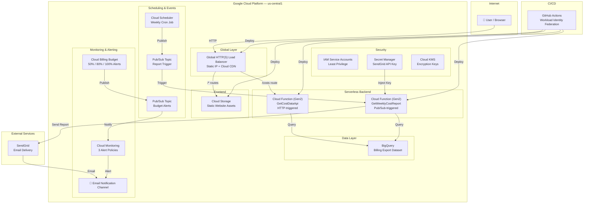

# GCP Cloud Cost Calculator — Automated Cost Monitoring & Alerting

> An end-to-end, **serverless** web application on **Google Cloud Platform** that provides real-time cost monitoring, budget alerting, and a premium dynamic dashboard. The entire infrastructure is managed by **Terraform** (9 modular modules) and deployed via a professional **CI/CD pipeline** with **Workload Identity Federation** (keyless authentication).

> This project demonstrates production-grade **cloud engineering**, **Infrastructure as Code**, **serverless architecture**, and **DevSecOps** practices — migrated from AWS to GCP with equivalent or superior service mappings.



---

## Architecture Diagram



---

## Key Features

| Feature | Description |
|---------|-------------|
| **Real-Time Cost Dashboard** | Premium dark-theme web UI with Chart.js bar & doughnut charts, cost breakdown by service, and summary cards showing net cost, credits, and active services. |
| **Serverless API Backend** | Cloud Function (Gen2) queries BigQuery billing export and returns cost data as JSON — no servers to manage. |
| **Automated Budget Alerts** | Cloud Billing Budget triggers Pub/Sub alerts at 50%, 80%, and 100% thresholds, with email notifications via Cloud Monitoring. |
| **Automated Weekly Reports** | Cloud Scheduler triggers a weekly Cloud Function that generates a styled HTML cost report and emails it via SendGrid. |
| **Infrastructure as Code** | 9 modular Terraform modules. Zero manual console clicks. Reproducible in minutes. |
| **DevSecOps CI/CD** | 4-stage GitHub Actions pipeline: validate → infra → build → deploy. Keyless auth via WIF. |
| **Security Hardened** | Least-privilege IAM, Secret Manager, Cloud KMS encryption, Checkov security scanning. |
| **Global CDN** | Cloud CDN on the Load Balancer backend bucket for fast, cached frontend delivery worldwide. |

---

## Technology Stack

| Category | Technology |
|----------|-----------|
| **Cloud Provider** | Google Cloud Platform (GCP) |
| **Compute** | Cloud Functions (2nd Gen — serverless, scale-to-zero) |
| **Data Warehouse** | BigQuery (billing export queries) |
| **Storage** | Cloud Storage (static frontend hosting) |
| **CDN & Load Balancing** | Global HTTP(S) Load Balancer, Cloud CDN, Serverless NEG |
| **Scheduling** | Cloud Scheduler (cron-based triggers) |
| **Messaging** | Pub/Sub (event-driven communication) |
| **Monitoring** | Cloud Monitoring (alert policies, uptime checks) |
| **Budget Alerts** | Cloud Billing Budget API (threshold-based alerts) |
| **Security** | IAM Service Accounts, Secret Manager, Cloud KMS |
| **Email Delivery** | SendGrid API (weekly cost report emails) |
| **IaC** | Terraform 1.6+ (modular architecture, GCS remote state) |
| **CI/CD** | GitHub Actions, Workload Identity Federation (OIDC — keyless) |
| **Frontend** | HTML, CSS (premium dark theme), vanilla JavaScript, Chart.js |
| **Security Scanning** | TFLint, Checkov |
| **Application** | Python 3.11, functions-framework, google-cloud-bigquery |

---

## Project Structure

```
.
├── .github/workflows/
│   ├── deploy-dev.yml                # 4-stage CI/CD: validate → infra → build → deploy
│   └── destroy-dev.yml               # 2-stage teardown with safety confirmation
│
├── environments/
│   └── dev/
│       ├── main.tf                   # Root module — composes all 9 modules
│       ├── variables.tf              # Input variables with validation
│       ├── outputs.tf                # Dashboard URL, LB IP, API URL
│       ├── backend.tf                # GCS remote state configuration
│       ├── providers.tf              # Google provider v6 + version constraints
│       └── terraform.tfvars          # Environment-specific values
│
├── modules/
│   ├── apis/                         # Enable 18 required GCP APIs
│   ├── iam/                          # 2 service accounts + least-privilege IAM bindings
│   ├── kms/                          # Cloud KMS keyring + crypto key (90-day rotation)
│   ├── storage/                      # Cloud Storage bucket (frontend, uniform access, CORS)
│   ├── cloud_functions/              # 2 Cloud Functions (Gen2) + source staging bucket
│   ├── load_balancer/                # Global HTTP(S) LB + Cloud CDN + Serverless NEG
│   ├── pubsub/                       # 2 Pub/Sub topics (report trigger + budget alerts)
│   ├── scheduler/                    # Cloud Scheduler weekly cron job
│   └── monitoring/                   # Budget, uptime check, 3 alert policies, email channel
│
├── src/
│   └── functions/
│       ├── get_cost_api/             # HTTP Cloud Function — BigQuery cost query → JSON
│       │   ├── main.py
│       │   └── requirements.txt
│       └── get_cost_report/          # Pub/Sub Cloud Function — cost report → SendGrid email
│           ├── main.py
│           └── requirements.txt
│
├── frontend/
│   └── public/
│       ├── index.html                # Dashboard with Chart.js integration
│       ├── style.css                 # Premium dark theme (glassmorphism, GCP brand)
│       └── script.js                 # Dashboard controller (fetch, render, charts)
│
├── docs/
│   └── ARCHITECTURE.md               # Architecture Decision Record
│
├── .tflint.hcl                       # TFLint configuration (Google plugin)
├── .gitignore
└── README.md
```

---

## Prerequisites

| Requirement | Version | Purpose |
|-------------|---------|---------|
| Google Cloud Account | — | Active billing account ($300 free trial works) |
| `gcloud` CLI | Latest | GCP authentication and project setup |
| Terraform | ≥ 1.6.0 | Infrastructure as Code |
| Python | ≥ 3.11 | Cloud Functions runtime |
| GitHub Account | — | CI/CD pipeline via Actions |
| SendGrid Account | Free tier | Weekly cost report email delivery |

---

## Setup and Deployment

### 1. GCP Project Configuration

```bash
# Set your project ID
export PROJECT_ID="cloud-cost-calculator-dev"

# Create the project (if not exists)
gcloud projects create $PROJECT_ID --name="Cloud Cost Calculator"

# Set the active project
gcloud config set project $PROJECT_ID

# Link billing account
gcloud billing accounts list
gcloud billing projects link $PROJECT_ID --billing-account=BILLING_ACCOUNT_ID
```

### 2. Enable BigQuery Billing Export

```bash
# This must be done in the Cloud Console:
# 1. Go to Billing → Billing export
# 2. Select "Standard usage cost" tab
# 3. Set project to your project
# 4. Create a new dataset named "billing_export"
# 5. Click "Save"
#
# The table will be created automatically as:
#   gcp_billing_export_v1_XXXXXX_XXXXXX_XXXXXX
# (billing account ID with hyphens replaced by underscores)
```

### 3. Create Terraform State Bucket

```bash
# Create a GCS bucket for Terraform remote state
gsutil mb -p $PROJECT_ID -l us-central1 gs://costcalc-terraform-state-dev

# Enable versioning for state recovery
gsutil versioning set on gs://costcalc-terraform-state-dev
```

### 4. Store SendGrid API Key

```bash
# Create the secret (Terraform creates the secret resource, this adds the value)
echo -n "YOUR_SENDGRID_API_KEY" | gcloud secrets versions add costcalc-dev-sendgrid-key --data-file=-
```

### 5. Configure Workload Identity Federation (Keyless CI/CD)

```bash
# Create a Workload Identity Pool
gcloud iam workload-identity-pools create "github-pool" \
  --project=$PROJECT_ID \
  --location="global" \
  --display-name="GitHub Actions Pool"

# Create a Workload Identity Provider (OIDC)
gcloud iam workload-identity-pools providers create-oidc "github-provider" \
  --project=$PROJECT_ID \
  --location="global" \
  --workload-identity-pool="github-pool" \
  --display-name="GitHub Provider" \
  --attribute-mapping="google.subject=assertion.sub,attribute.repository=assertion.repository" \
  --attribute-condition="assertion.repository=='YOUR_GITHUB_USER/Cloud-Cost-Calculator'" \
  --issuer-uri="https://token.actions.githubusercontent.com"

# Create the GitHub service account
gcloud iam service-accounts create costcalc-dev-github-sa \
  --project=$PROJECT_ID \
  --display-name="GitHub Actions SA"

# Grant required roles (all needed for full lifecycle)
SA="serviceAccount:costcalc-dev-github-sa@${PROJECT_ID}.iam.gserviceaccount.com"
for ROLE in \
  roles/editor \
  roles/cloudfunctions.admin \
  roles/iam.serviceAccountAdmin \
  roles/iam.serviceAccountUser \
  roles/resourcemanager.projectIamAdmin \
  roles/secretmanager.admin \
  roles/storage.admin \
  roles/compute.networkAdmin \
  roles/monitoring.admin \
  roles/billing.viewer; do
  gcloud projects add-iam-policy-binding $PROJECT_ID --member="$SA" --role="$ROLE"
done

# Allow the GitHub repo to impersonate the service account
PROJECT_NUMBER=$(gcloud projects describe $PROJECT_ID --format="value(projectNumber)")
gcloud iam service-accounts add-iam-policy-binding \
  "costcalc-dev-github-sa@${PROJECT_ID}.iam.gserviceaccount.com" \
  --project=$PROJECT_ID \
  --role="roles/iam.workloadIdentityUser" \
  --member="principalSet://iam.googleapis.com/projects/${PROJECT_NUMBER}/locations/global/workloadIdentityPools/github-pool/attribute.repository/YOUR_GITHUB_USER/Cloud-Cost-Calculator"
```

### 6. Update Configuration Files

| File | What to Change |
|------|---------------|
| `environments/dev/terraform.tfvars` | `project_id`, `billing_account_id`, `billing_table_id`, `notification_email` |
| `environments/dev/backend.tf` | GCS state bucket name |
| `.github/workflows/deploy-dev.yml` | `WIF_PROVIDER`, `WIF_SERVICE_ACCOUNT` |
| `.github/workflows/destroy-dev.yml` | Same WIF values |

### 7. Deploy

```bash
# Push to main branch — the CI/CD pipeline handles everything automatically
git add . && git commit -m "Initial deployment" && git push origin main
```

The 4-stage pipeline will:
1. **Validate** — `terraform fmt`, `tflint`, `checkov`
2. **Infrastructure** — Provision APIs, IAM, KMS, Storage, Functions, LB, Monitoring
3. **Build** — Upload Cloud Function source code to staging bucket
4. **Deploy** — Sync frontend to Cloud Storage with API endpoint injection

---

## How to Use

### Access the Dashboard

```bash
# Get the dashboard URL after deployment
cd environments/dev && terraform output dashboard_url
```

Open the URL in your browser to see the cost monitoring dashboard.

### View the Cost API

```bash
# Get cost data as JSON
curl $(terraform output -raw cost_api_function_url)/costs
```

### Trigger a Manual Report

```bash
# Manually trigger the weekly cost report
gcloud scheduler jobs run costcalc-dev-weekly-cost-report --location=us-central1
```

---

## Alerting System

### Budget Alerts (Cloud Billing Budget)

```
Monthly spend exceeds threshold
  → Budget API detects threshold breach (50%, 80%, 100%)
  → Publishes message to Pub/Sub topic
  → Cloud Monitoring notification channel fires
  → Email notification sent to configured address
```

### Infrastructure Alerts (Cloud Monitoring)

| Alert Policy | Trigger | Duration |
|-------------|---------|----------|
| **Dashboard Down** | Uptime check fails | 5 min |
| **Function Errors** | >5 errors in Cloud Functions | 5 min |
| **Budget Exceeded** | Spend exceeds 50/80/100% of budget | Immediate |

All alerts are sent to the email configured in `terraform.tfvars` → `notification_email`.

---

## AWS → GCP Service Mapping

This project was migrated from AWS. Here's the 1:1 service mapping:

| AWS Service | GCP Equivalent | Rationale |
|------------|----------------|-----------|
| AWS Lambda | **Cloud Functions (Gen2)** | Serverless compute with scale-to-zero |
| API Gateway | **Cloud Functions URL + LB** | Built-in HTTP endpoint with Gen2 |
| S3 (Static Site) | **Cloud Storage** | Object storage with static hosting |
| CloudFront (CDN) | **Cloud CDN + Global LB** | CDN with backend bucket support |
| CloudWatch Billing Alarm | **Cloud Billing Budget** | Native budget threshold alerts |
| SNS | **Pub/Sub** | Event-driven messaging |
| SES | **SendGrid** | Email delivery (SES has no GCP equivalent) |
| KMS | **Cloud KMS** | Encryption key management with auto-rotation |
| IAM Roles | **Service Accounts + IAM** | Least-privilege access control |
| CloudWatch Events | **Cloud Scheduler** | Cron-based job scheduling |
| S3 Backend (TF state) | **GCS Backend** | Terraform remote state with versioning |
| OIDC (GitHub Actions) | **Workload Identity Federation** | Keyless CI/CD authentication |

---

## Security Architecture

| Control | Implementation |
|---------|---------------|
| **Authentication** | Workload Identity Federation (OIDC — no service account keys) |
| **Secrets** | Secret Manager (SendGrid API key never in code or CI vars) |
| **Encryption** | Cloud KMS (auto-rotating keys every 90 days) |
| **IAM** | 2 dedicated service accounts with least-privilege roles |
| **API Security** | Cost API is public (read-only), Report function is internal-only |
| **State Security** | Terraform state in GCS with versioning |
| **Code Scanning** | TFLint + Checkov in CI pipeline |
| **Budget Protection** | Proactive alerts at 50%, 80%, 100% + forecasted spend |

---

## Cost Estimate

| Resource | Monthly Cost |
|----------|-------------|
| Cloud Functions (2× scale-to-zero) | ~$0-2 |
| BigQuery (billing queries, first 1TB free) | ~$0-1 |
| Cloud Storage (frontend assets) | ~$0.01 |
| Global HTTP(S) Load Balancer | ~$18 |
| Cloud Scheduler (1 job) | ~$0 (free tier) |
| Cloud Monitoring + Pub/Sub | ~$0-1 |
| **Total** | **~$18-22/month** |

> With the $300 GCP free trial credit, this runs for **13-16 months** at no cost.

---

## Destroying the Infrastructure

1. Navigate to the **Actions** tab in your GitHub repository
2. Select the **"Destroy Cloud Cost Calculator — Dev"** workflow
3. Click **"Run workflow"**
4. Type `destroy` when prompted

The 2-stage destroy pipeline will:
1. Verify the confirmation phrase
2. Run `terraform destroy` to clean up all resources

---

## Future Improvements

| Improvement | Description |
|-------------|-------------|
| **HTTPS + Custom Domain** | Cloud DNS + Google-managed SSL certificate |
| **Authentication** | Identity-Aware Proxy (IAP) for dashboard access control |
| **Slack/PagerDuty Alerts** | Additional notification channels via Pub/Sub |
| **Cloud Armor WAF** | Web Application Firewall rules on the Load Balancer |
| **Multi-Environment** | Add staging/production with Terraform workspaces |
| **Tag-Based Cost Groups** | Group costs by labels/tags for team billing |
| **Grafana Dashboard** | Add Grafana with BigQuery as data source |
| **Cost Anomaly Detection** | ML-based anomaly detection with Vertex AI |

---

## License

This project was built as a comprehensive demonstration of professional cloud engineering, Infrastructure as Code, serverless architecture, and DevSecOps practices on Google Cloud Platform.

**Author:** Yisak Mesifin
**GitHub:** [yisakm9/Cloud-Cost-Calculator](https://github.com/yisakm9/Cloud-Cost-Calculator)
